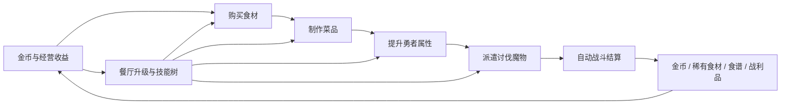

# 核心循环

状态：草案  
上级索引：[[design/README|Design Knowledge Base]]

## 目的

定义玩家从经营餐厅、强化勇者、应对袭击到获得奖励的主循环。所有核心系统都应挂接到这条循环上。

## 主循环

1. 获取金币：来自餐厅经营、勇者消费、讨伐奖励或增量收益。
2. 购买食材：玩家使用金币购买基础食材，稀有食材可通过讨伐或高级解锁获得。
3. 制作菜品：玩家把食材转化为菜品。
4. 强化勇者：菜品提升勇者攻击、防御、生命、魔法攻击、技能强度或其他战斗属性。
5. 升级餐厅：金币和经营进度提升餐厅等级，解锁高级食谱、更强勇者和技能树节点。
6. 等待袭击：魔物周期性刷新，并在袭击前显示倒计时预警。
7. 派遣讨伐：玩家选择多名勇者出战，根据威胁和属性判断队伍。
8. 自动战斗：系统根据勇者与魔物属性进行自动结算。
9. 获得奖励：成功讨伐可获得金币、稀有食材、稀有食谱和战利品。
10. 反哺经营：奖励提升后续食材购买、菜品制作、餐厅升级、勇者成长或讨伐效率。

## 核心闭环图

## 短期循环

短期循环以 30 秒到 3 分钟为单位：

- 查看当前金币和食材。
- 制作可负担菜品。
- 给勇者提升关键属性。
- 观察袭击倒计时。
- 在倒计时前完成一次准备动作。

## 中期循环

中期循环以 5 到 20 分钟为单位：

- 完成一次袭击讨伐。
- 获得新食材、食谱或战利品。
- 提升餐厅等级。
- 点亮技能树节点。
- 解锁更高难度袭击或更强勇者。

## 长期循环

长期循环以数小时或多次游玩为单位：

- 建立稳定食材和金币效率。
- 形成面向不同魔物的勇者培养方向。
- 收集战利品，推动被动效果叠加。
- 解锁高阶食谱和高阶袭击。
- 优化每轮袭击前的准备策略。

## 设计准则

- 玩家每次进入游戏都应能快速判断当前最值得做的 1-3 个动作。
- 袭击倒计时应创造目标，不应制造无法挽回的突袭惩罚。
- 经营收益和讨伐收益都应必要，避免任一循环完全压倒另一循环。
- 菜品强化勇者必须处于主循环中心。
- 奖励应优先提供新选择，其次才是纯数值。

## 待验证问题

- 魔物袭击间隔多长最合适？
- 玩家能否在首轮袭击前理解菜品与属性的关系？
- 讨伐失败的惩罚应是资源损失、冷却时间、餐厅损坏，还是只损失机会？

## 关联文档

- [[design/01_core_gameplay/02_restaurant_operations|餐厅经营]]
- [[design/01_core_gameplay/04_adventurer_growth|勇者成长]]
- [[design/01_core_gameplay/05_raid_warning_and_dispatch|袭击预警与派遣]]
- [[design/01_core_gameplay/06_auto_battle_system|自动战斗系统]]
