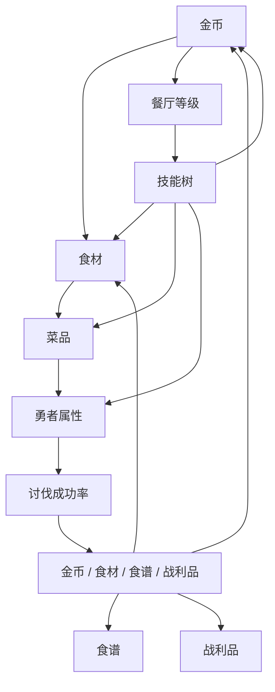

# 资源与经济

状态：草案  
上级索引：[[design/README|Design Knowledge Base]]

## 目的

定义金币、食材、菜品、餐厅等级、食谱、战利品等资源之间的流向。

## 资源类型

| 资源 | 来源 | 用途 |
| --- | --- | --- |
| 金币 | 经营收益、讨伐奖励 | 购买食材、升级餐厅、解锁节点 |
| 食材 | 金币购买、讨伐掉落、被动产出 | 制作菜品 |
| 菜品 | 食材制作 | 提升勇者属性或提供临时增益 |
| 餐厅经验 / 声望 | 制作、营业、讨伐 | 提升餐厅等级或吸引勇者 |
| 食谱 | 餐厅等级、讨伐掉落、奖励 | 解锁新菜品 |
| 战利品 | 讨伐成功 | 提供被动增益 |
| 技能点 | 餐厅升级或阶段目标 | 解锁技能树节点 |

## 经济流向

## 设计准则

- 金币是基础资源，但不应解决所有问题。
- 稀有食材和稀有食谱应主要来自讨伐，保证战斗循环价值。
- 战利品应提供长期被动，减少纯一次性奖励的空洞感。
- 餐厅等级应作为内容闸门，而不是只有数值加成。

## 待验证问题

- 是否需要将餐厅升级消耗从金币中分离出“声望”？
- 菜品是否消耗后立即转化为属性，还是可以库存和批量使用？
- 食材购买是否需要刷新商店，还是固定可购买列表？

## 关联文档

- [[design/04_balance_data/01_economy_curve|经济曲线]]
- [[design/02_content_systems/05_loot_and_trophies|掉落与战利品]]
- [[design/02_content_systems/07_skill_tree|技能树]]

